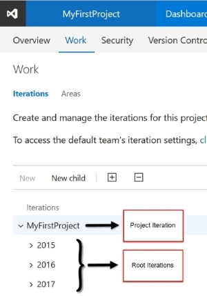
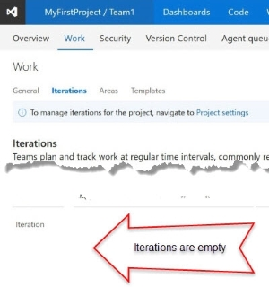
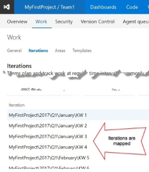
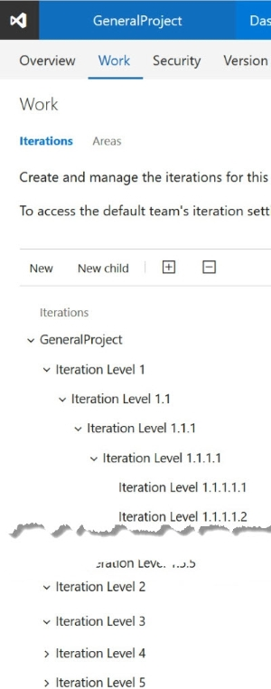
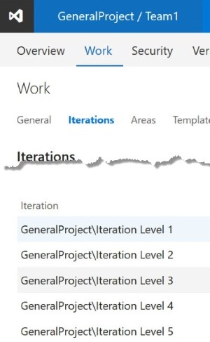
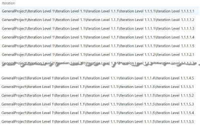
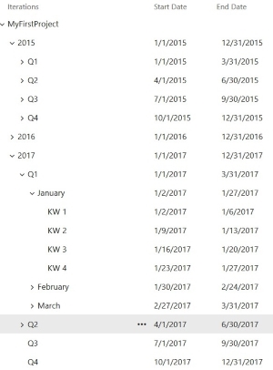
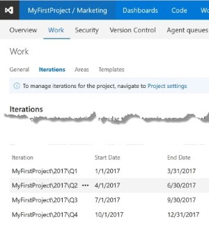

# Relate-VstsIteration
> This PowerShell script relates multiple iterations with teams in VSTS or TFS.

The script relates every exact level of iteration tree to a team. Each child of project iteration is a discrete iteration tree. This means that a project has any number of iteration.

# Table of Content

* [Install](#install)
    * [Run Script](#run-script)
    * [Run Unit Test](#run-unit-test)
* [Usage](#usage)
    * [Example 1: Relate all Weeks of 2017 to Team1](#example-1-relate-all-weeks-of-2017-to-team1)
    * [Example 2: Relate the root iteration to all teams](#example-2-relate-the-root-iteration-to-all-teams)
    * [Example 3: Relate level 5 to a team](#example-3-relate-level-5-to-a-team)
    * [Example 4: Relate Q1, Q2, Q3 and Q4 2017 to the team "Marketing"](#example-4-relate-q1-q2-q3-and-q4-2017-to-the-team-marketing)
* [API](#api)
    * [Syntax](#syntax)
    * [Parameter](#parameter)
        * [Username (required, if AuthentificationType is "Token")](#username-required-if-authentificationtype-is-token)
        * [Token (required, if AuthentificationType is "Token")](#token-required-if-authentificationtype-is-token)
        * [Credential (required, if AuthentificationType is "Basic")](#credential-required-if-authentificationtype-is-basic)
        * [AuthentificationType (required)](#authentificationtype-required)
        * [Projecturi (required)](#projecturi-required)
        * [TeamList (required)](#teamlist-required)
        * [StartOfIterationPath (optional)](#startofiterationpath-optional)

# Install
##  Run Script
1.  Download the script

2.  Open PowerShell

3.  Change directory to the location of the script

4.  Load the script

    ```powershell
      . .\Relate-VstsIteration.ps1 
    ```

5.  Run the script

    VSTS:
    ```powershell
    Relate-VstsIteration -Projecturi "https://example.visualstudio.com/MyFirstProject" -Username "user@example.com" -Token "h2ixjlahgmrfb722yo23kzohh9f1evc2wf1bwhnwme9fn59dky3v" -AuthentificationType "Token" -TeamList "Team"
    ```

    TFS:
    ```powershell
    Relate-VstsIteration -Projecturi "https://[Url]/[Collection name]/[Project name]" -Credential (Get-Credential -UserName "Domain\User" -Message: "TFS 2015 Login") -AuthentificationType "Basic" -TeamList "Team"
    ```

##  Run Unit Test
1.  Install [Pester](https://github.com/pester/Pester)

2.  Download the script

3.  Open PowerShell

4.  Change directory to the location of the script

5.  Run the tests

    ```powershell
    Invoke-Pester -Script .\Test
    ```

# Usage
The script is suitable for Visual Studio Team Services and Team Foundation Server. When you use the Visual Studio Team Services, 
the Login needs a Personal Access Token and corresponding Uri-Adresse ([How To: CreatePersonal AccessToken](https://www.visualstudio.com/en-us/docs/setup-admin/team-services/use-personal-access-tokens-to-authenticate)).
When you use the Team Foundation Server, the Login needs Credential and corresponding Uri-Adresse, because all version older than 2017 has no AccessToken. 

## Example 1: Relate all Weeks of 2017 to Team1

> This example demonstrates, how all weeks of a year are being related to the team "Team1". The year, month and weeks are iteration on the project "MyFirstProject". The difference between these iterations is the level.

Iterations for your project: 



Situation of iterations at the team "Team1"



Calling script:

Both calls have the same result. It is only important to gives a level 4 iteration in the parameter "StartOfIterationPath". It is not important, which iteration item you specify on the parameter.  

VSTS:
```PowerShell
Relate-VstsIteration -Username "[Login name]" -Projecturi "https://[Subscription].visualstudio.com/[Project name]" -token "[Key]" -StartOfIterationPath "2017/Q2/April/KW 17" -AuthentificationType "Token" -TeamList "MyFirstProject"
```

```PowerShell
Relate-VstsIteration -Username "[Login name]" -Projecturi "https://[Subscription].visualstudio.com/[Project name]" -token "[Key]" -StartOfIterationPath "2017/Q1/January/KW 1" -AuthentificationType "Token" -TeamList "MyFirstProject"
```
TFS: 
```PowerShell
Relate-VstsIteration -Projecturi "https://[Url]/[Collection name]/[Project name]" -StartOfIterationPath "2017/Q1/January/KW 1" -AuthentificationType "Basic" -(Get-Credential -UserName "Domain\User" -Message: "TFS 2015 Login") -TeamList "MyFirstProject"
```

When the scripts is finished, all of the weeks are mapped:



## Example 2: Relate the root iteration to all teams

> This example demonstrates, how the iterations of the first level (root iterations) are being related to the team "Team1".   

General iteration tree of the project „GeneralProject"



Calling script:

VSTS:
```PowerShell
Relate-VstsIteration -Username "[Login name]" -Projecturi "https://[Subscription].visualstudio.com/GeneralProject" -token "[Key]" -AuthentificationType "Token" -TeamList "Team1"
```

Result in all teams of the project:



## Example 3: Relate level 5 to a team

> This example demonstrates, how the iterations in the fifth level are being related to the team "GeneralProject".

General iteration tree of the project „GeneralProject"


Calling script:

VSTS:
```PowerShell
Relate-VStsIteration -Username "[Login name]" -Projecturi "https://[Subdiscription].visualstudio.com/[Project name]" -Token "[Key]" -AuthentificationType "Token" -TeamList "Team1" -StartOfIterationPath "Iteration Level 1/Iteration Level 1.1/Iteration Level 1.1.3/Iteration Level 1.1.3.1/Iteration Level 1.1.3.1.5"
```

Result in "Team1" of the project:



## Example 4: Relate Q1, Q2, Q3 and Q4 2017 to the team "Marketing"

> This example demonstrates, how each quarter of the year 2017 is being related to the team "Marketing".

Iteration tree of the project „MyFirstProject"



Calling script:

VSTS:
```PowerShell
Relate-VStsIteration -Username "[Login]" -Token "[Key]" -Projecturi "https://[Subdiscription].visualstudio.com/[Project] -TeamList "Marketing" -StartOfIterationPath "2017/Q1"
```

Result:



# API
## Syntax

```PowerShell
Relate-VstsIteration [-Username] <String> [-Projecturi] <Uri> [-Token] <String> [-Credential] PSCredential [AuthentificationType] <String> [[-TeamList] <String[]> [-StartOfIterationPath]<String>]
```

## Parameter 

### Username (required, if AuthentificationType is "Token")
**Type:** String  
**Description:** Login name of the Visual Studio Team Services account.  
**Example:**
```PowerShell
"test.email@example.com"  
```

### Token (required, if AuthentificationType is "Token")
**Type:** String  
**Description:** Personal Access Token, which is association with the username.  
**Example**: 
```PowerShell
"h2ixjlahgmrfb722yo23kzohh9f1evc2wf1bwhnwme9fn59dky3v"  
```

### Credential (required, if AuthentificationType is "Basic")
**Type:** PSCredential  
**Description:** It is a set of security credentials, such as a user name and a password.  
**Example**:  
```PowerShell
Get-Credential -UserName "Domain\Username" -Message: "TFS 2015 Login"
```

### AuthentificationType (required)
**Type:** string  
**Description:** Only the two value "Token" and "Basic" are allow.  
**Example**:  
```PowerShell
"Token"
```

```PowerShell
"Basic"
```

### Projecturi (required)
**Type:** Uri  
**Description:** The URI of the Team Project.  
**Example**: 
```PowerShell
"https://example.visualstudio.com/MyFirstProject"
```
```PowerShell
"https://sec.visualstudio.com/AppSec"
```

### TeamList (required)
**Type:** String[]  
**Description:** List of Team names.  
**Example:** 
```PowerShell
"Team1", "Team2", "Team3"
```
```PowerShell
"Marketing"
```
```PowerShell
"Marketing","Development","Production","Testmanagment"
```

### StartOfIterationPath (optional)
**Type:** String  
**Description:** The level at the iteration tree which is assigned to the teams. If no value is provided, the script relates all root iteration to the teams. Warning: The project name must not be indicated to the path.
 It is important to use a slash as delimiter.  
**Example:** 
```PowerShell
"2017/Q1/January/KW 1"
```
```PowerShell
"Iteration Level 1/Iteration Level 1.2"
```
```PowerShell
"extra-large-text-without-spaces"
```
```PowerShell
"2017/Q1/January/KW 1 - KW 2/KW 1"
```
```PowerShell
"2017/Q4/November"
```
